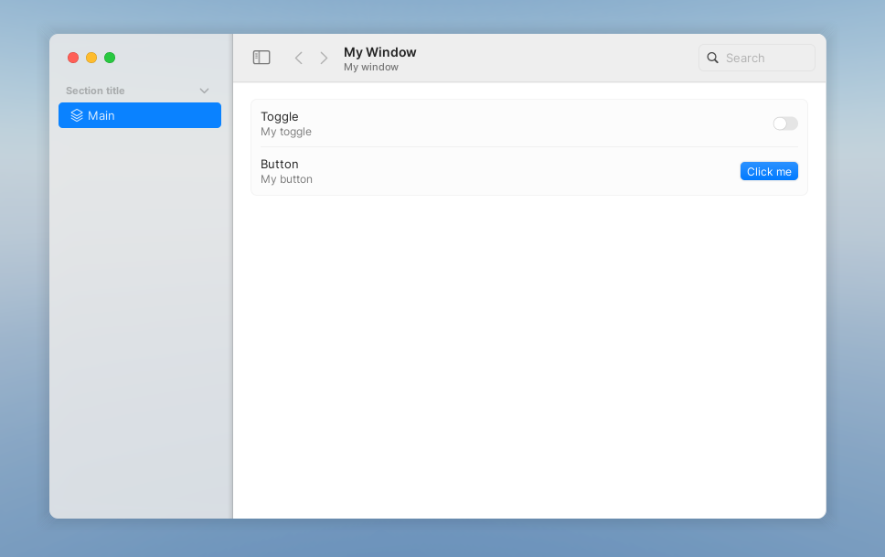

#  

[stars]: https://github.com/biggaboy212/Cascade/stargazers
[lastrel]: https://github.com/biggaboy212/Cascade/releases/latest
[lastcom]: https://github.com/biggaboy212/Cascade/commits
[disc]: https://discord.gg/2cB4vBAEWk

[badges/stars]: https://img.shields.io/github/stars/biggaboy212/Cascade?label=Stars&logo=GitHub
[badges/lastrel]: https://img.shields.io/github/v/release/biggaboy212/Cascade?include_prereleases&label=Latest%20Release
[badges/lastcom]: https://img.shields.io/github/last-commit/biggaboy212/Cascade?label=Last%20Modifed
[badges/disc]: https://img.shields.io/discord/1384338360012898406?&label=Discord

[![Stars][badges/stars]][stars]
[![Latest Release][badges/lastrel]][lastrel]
[![Last Modified][badges/lastcom]][lastcom]
[![Discord][badges/disc]][disc]

Cascade is a LuaU UI library based on macOS Sequoia.


## The Pitch

Cascade is a retained-mode, user-centric UI library designed to be both easy for developers and beautiful for users. Its API is fully typed, so once you learn one component, you can use 99% of the rest without needing to reference the documentation.

Cascade was designed from the ground up as a superior design paradigm. It combines simplicity and customizability into a high level bloat-free API, enabling developers to build polished software-grade UIs in minutes.

## Usage

### Importing the library

#### From source

To use cascade from source, simply clone the repository into your packages folder and you can reference `src/init.luau` from there.

#### From release

You can download a valid release from our github releases page, or in single-file systems, you can load it dynamically in-game:

```lua
local function import(owner, release, version, file)
    local tag = (version == "latest" and "latest" or "download/"..version)
    return loadstring(game:HttpGet(("https://github.com/%s/%s/releases/%s/%s"):format(owner, release, tag, file)), file)()
end

local cascade = import("biggaboy212", "Cascade", "v1.0.0-beta.2", "pre.luau")
```

### Adding components

You can choose how complex to make your app, we dont bombard you with useless bloat that makes the library a borderline instance creator.

```lua
-- Create our main application.
local app = cascade.New({ Theme = cascade.Themes.Light })

do -- Make the main window
    local window = app:Window({
        Title = "My Window",
        Subtitle = "My window",
    })

    do -- Make a static tab section
        local section = window:Section({ Title = "Section title" })

        do -- Make our main tab
            local tab = section:Tab({
                Selected = true,
                Title = "Main",
                Icon = cascade.Symbols.squareStack3dUp,
            })

            do
                local form = tab:Form()
            
                do -- Make the toggle
                    local row = form:Row()

                    -- You can of course add a wrapper to simplify creating page components if you only want a title stack and a component to go along.
                    row:Left():TitleStack({
                        Title = "Toggle",
                        Subtitle = "My toggle",
                    })

                    row:Right():Toggle()
                end

                do -- Make the button
                    local row = form:Row()

                    row:Left():TitleStack({
                        Title = "Button",
                        Subtitle = "My button",
                    })

                    row:Right():Button({ Label = "Click me" })
                end
            end
        end
    end
end
```



### Getting started

Reference the [Cascade documentation](https://biggaboy212.github.io/Cascade/) for more.
