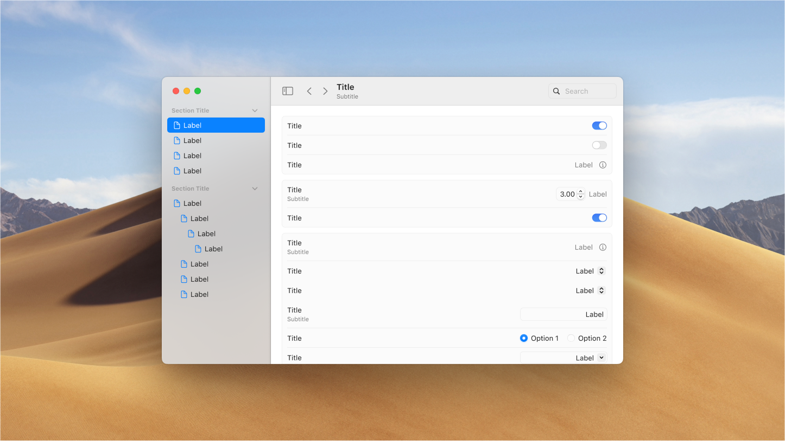
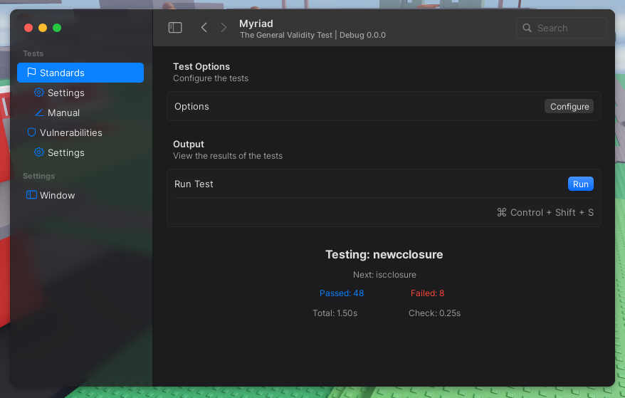
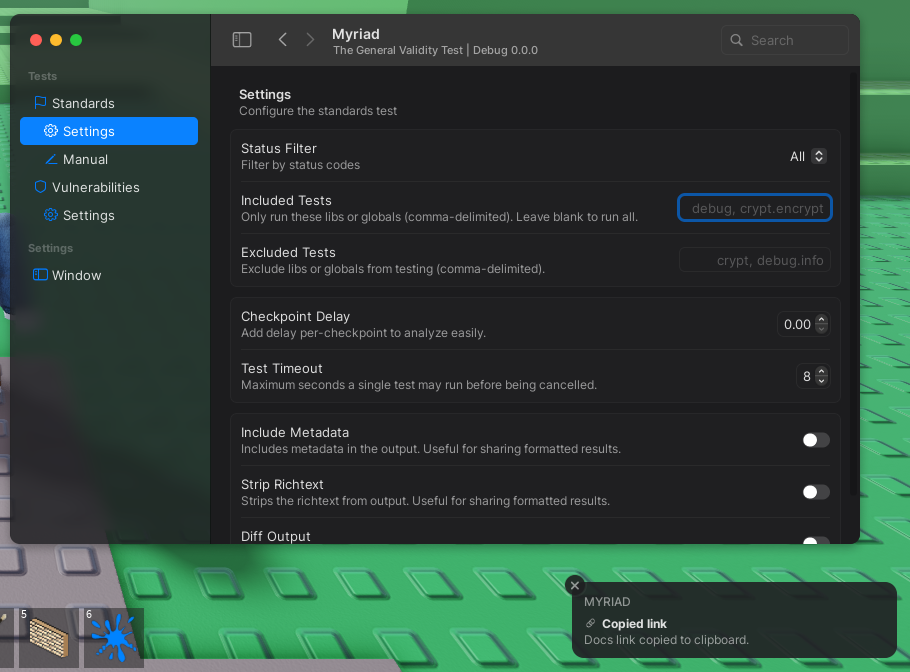

  <picture>
    <source media="(prefers-color-scheme: dark)" srcset="assets/cascade_span_dark.png">
    <source media="(prefers-color-scheme: light)" srcset="assets/cascade_span_light.png">
    
  </picture>

   

[![Stars][badges/stars]][stars]
[![Latest Release][badges/lastrel]][lastrel]
[![Last Modified][badges/lastcom]][lastcom]
[![Publish docs][badges/publish]][publish]

[![Discord][badges/disc]][disc]

Cascade is a Luau UI library based on macOS Sequoia.

[stars]: https://github.com/biggaboy212/Cascade/stargazers
[lastrel]: https://github.com/biggaboy212/Cascade/releases/latest
[lastcom]: https://github.com/biggaboy212/Cascade/commits
[publish]: https://github.com/biggaboy212/Cascade/actions/workflows/publish.yml
[disc]: https://discord.gg/2cB4vBAEWk
[badges/stars]: https://img.shields.io/github/stars/biggaboy212/Cascade?label=Stars&logo=GitHub
[badges/lastrel]: https://img.shields.io/github/v/release/biggaboy212/Cascade?include_prereleases&label=Latest%20Release
[badges/lastcom]: https://img.shields.io/github/last-commit/biggaboy212/Cascade?label=Last%20Modifed
[badges/publish]: https://img.shields.io/github/actions/workflow/status/biggaboy212/Cascade/.github%2Fworkflows%2Fpublish.yml?label=Publish%20Docs
[badges/disc]: https://img.shields.io/discord/1384338360012898406?&label=Discord

## The Pitch

Cascade is a retained-mode, user-centric UI library designed to be both easy for developers and beautiful for users. Its API is fully typed, so once you learn one component, you can use 99% of the rest without needing to reference the documentation.

Cascade was designed from the ground up as a superior design paradigm. It combines simplicity and customizability into a high level bloat-free API, enabling developers to build polished software-grade UIs in minutes.

## Usage

Reference the [Cascade documentation](https://biggaboy212.github.io/Cascade/) for more.

- [Importing the Library](https://biggaboy212.github.io/Cascade/Getting%20Started/importing-the-library/)
- [The API](https://biggaboy212.github.io/Cascade/Getting%20Started/the-api/)
- [Components](https://biggaboy212.github.io/Cascade/Components/)

## Supporting the project

If you'd like to support the project, consider donating via any of these:

- **LTC**: `Lcd6pCPiVw9GH2MAaGkR8TX39EtL2LzFoa`
- **SOL**: `EfwivXazedEw2kL2et92NKDkT3qrQ6pdxA8Bs7RKYRuN`
- **ETH**: `0x85C09A302CBB42a321E737E6E4dDAC0Eebc4ac3E`
- **BTC**: `bc1qlhym0f0lejwlhd47gext8g7fgej366j7z85vvx`

## Star History

<a href="https://www.star-history.com/?repos=biggaboy212%2FCascade&type=date&legend=top-left">
 <picture>
   <source media="(prefers-color-scheme: dark)" srcset="https://api.star-history.com/chart?repos=biggaboy212/Cascade&type=date&theme=dark&legend=top-left" />
   <source media="(prefers-color-scheme: light)" srcset="https://api.star-history.com/chart?repos=biggaboy212/Cascade&type=date&legend=top-left" />
   
 </picture>
</a>

## Gallery

### [Myriad General Validity Test](https://github.com/Proton-Utilities/Myriad)

