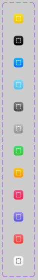
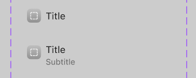

# ImageSurface

An `ImageSurface` displays an image on top of a colored surface.


## Summary

### Properties

| Property       | Type              | Description                                                                          |
| -------------- | ----------------- | ------------------------------------------------------------------------------------ |
| `Image`        | `#!luau string?`  | The `20 x 20` image asset ID displayed on the surface. You can use `cascade.Symbols` |
| `ImageColor`   | `#!luau Color3?`  | The tint color applied to the image. Defaults to `Color3.fromRGB(255, 255, 255)`.    |
| `SurfaceColor` | `#!luau Color3?`  | The background color of the surface. Defaults to `Color3.fromRGB(200, 200, 200)`.    |
| `Gradient`     | `#!luau boolean?` | Enables the surface gradient. Defaults to `true`.                                    |

[View all inherited from `BaseComponent`](./index.md/#properties)

[View all inherited from `Frame`](https://create.roblox.com/docs/reference/engine/classes/Frame#summary-properties)

### Methods

[View all inherited from `Frame`](https://create.roblox.com/docs/reference/engine/classes/Frame#summary-methods)

### Events

[View all inherited from `Frame`](https://create.roblox.com/docs/reference/engine/classes/Frame#summary-events)

## Types

```luau
type ImageSurfaceProperties = Frame & {
    Image: string?,
    ImageColor: Color3?,
    SurfaceColor: Color3?,
    Gradient: boolean?,
}

type ImageSurface = BaseComponent & Components & ImageSurfaceProperties
```

### Function Signature

```luau
function(self, properties: ImageSurfaceProperties): ImageSurface
```

## Preview




## Example

```luau
local imageSurface = row:Left():ImageSurface({
    Image = cascade.Symbols.house,
    SurfaceColor = Color3.fromRGB(255, 107, 53),
})

print(imageSurface:IsA("Frame")) --> true
print(imageSurface.ClassName) --> "Frame"
print(imageSurface.Type) --> "ImageSurface"
```
