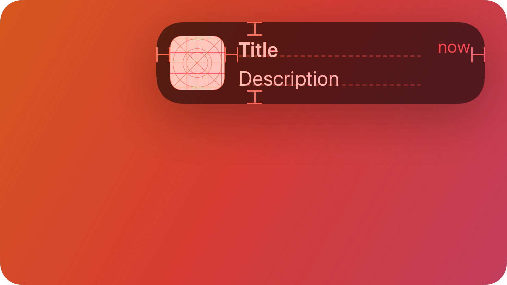

# Notification

A `Notification` gives people timely, high-value information they can understand at a glance.



## Summary

### Properties

| Name       | Type             | Description                                                                                                         |
| ---------- | ---------------- | ------------------------------------------------------------------------------------------------------------------- |
| `Title`    | `#!luau string`  | The primary headline of the notification.                                                                           |
| `Subtitle` | `#!luau string`  | The secondary text providing more context.                                                                          |
| `App`      | `#!luau string?` | Optional text to display what feature or app triggered the notification.                                            |
| `AppIcon`  | `#!luau string?` | Optional image asset ID to show an icon in the top left.                                                            |
| `Icon`     | `#!luau string?` | Optional image asset ID to show an icon in the top left, next to the title.                                         |
| `Duration` | `#!luau number?` | How long (in seconds) the notification remains before auto-closing. Defaults to `6`. Use `0` for manual close only. |

[View all inherited from `BaseComponent`](./index.md/#properties)

[View all inherited from `Frame`](https://create.roblox.com/docs/reference/engine/classes/Frame#summary-properties)

### Methods

| Name    | Returns      | Description                          |
| ------- | ------------ | ------------------------------------ |
| `Close` | `#!luau nil` | Manually dismisses the notification. |

[View all inherited from `Frame`](https://create.roblox.com/docs/reference/engine/classes/Frame#summary-methods)

### Events

| Name     | Parameters                                       | Description                                                              |
| -------- | ------------------------------------------------ | ------------------------------------------------------------------------ |
| `Closed` | `#!luau (self: Notification, fromUser: boolean)` | Fired when the notification is closed either via timeout or by the user. |

[View all inherited from `Frame`](https://create.roblox.com/docs/reference/engine/classes/Frame#summary-events)

## Types

```luau
type NotificationProperties = Frame & {
    Title: string,
    Subtitle: string,
    App: string?,
    AppIcon: string?,
    Icon: string?,
    Duration: number?,
    Closed: ((self: Notification, fromUserInput: boolean?) -> unknown)?,
}

type Notification = BaseComponent & Components & NotificationProperties & {
    Close: (self: Notification) -> nil,
}
```

### Function Signature

```luau
function(self, properties: NotificationProperties): Notification
```

## Example

```luau
local notification = app:Notification({
    App = "CHAT",
    AppIcon = "rbxassetid://132228700346004",

    Title = "New Message",
    Subtitle = "You received a new message from a friend.",
    Icon = cascade.Symbols.bell, -- Icon appears beside the title label.

    Duration = 5,

    Closed = function(self, fromUser)
        print("Notification was dismissed! (from user: " .. tostring(fromUser) .. ")")
    end
})

-- Sometime later, if you need to manually close it:
-- notification:Close()
```
