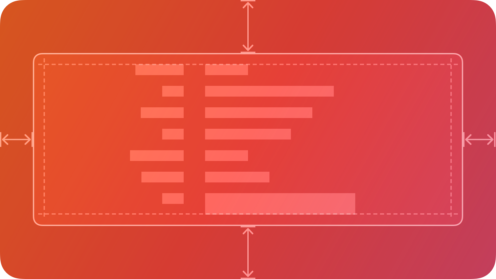

# Page

A `Page` is a container that holds content in a scrollable area. Pages are typically used with [Tabs](./Tab.md) to create navigable multi-page interfaces, but can also be used standalone.



## Summary

### Properties

[View all inherited from `BaseComponent`](./index.md/#properties)

[View all inherited from `Frame`](https://create.roblox.com/docs/reference/engine/classes/Frame#summary-properties)

### Methods

[View all inherited from `Frame`](https://create.roblox.com/docs/reference/engine/classes/Frame#summary-methods)

### Events

[View all inherited from `Frame`](https://create.roblox.com/docs/reference/engine/classes/Frame#summary-events)

## Types

```luau
type PageProperties = Frame

type Page = BaseComponent & Components & PageProperties
```

### Function Signature

```luau
function(self, properties: PageProperties?): Page
```

## Pages and Tabs

Pages are most commonly used with [Tabs](./Tab.md). Each Tab has an associated Page that displays when the tab is selected.

When you create a tab, it automatically creates a page for you:

### Tabs with custom pages

You can also pass your own page to a tab:

```luau
local customPage = app:Page()

-- Add content to your page
customPage:Form():PageSection({ Title = "Settings" })

-- Pass it to the tab
local tab = section:Tab({
    Title = "Settings",
    Page = customPage,
})
```

### Page Navigation

Use the `Navigate` method on a tab to switch between pages programmatically:

```luau
local homePage = app:Page()
local settingsPage = app:Page()

local tab = section:Tab({
    Title = "Routing",
    Selected = false,
})

-- Setup home page
do
    local form = homePage:Form()
    form:Row():Right():Button({
        Label = "Go to Settings",
        Pushed = function()
            tab:Navigate(settingsPage)  -- Switch to settings page
        end,
    })
end

-- Setup settings page
do
    local form = settingsPage:Form()
    form:Row():Right():Button({
        Label = "Back to Home",
        Pushed = function()
            tab:Navigate(homePage)  -- Switch back to home page
        end,
    })
end

-- Show home page initially
tab:Navigate(homePage)
```

## Examples

```luau
local app = cascade.New({
    Theme = cascade.Themes.Light,
})

local window = app:Window({
    Title = "My App",
})

local section = window:Section({
    Disclosure = false,
})

local tab = section:Tab({
    Title = "Navigation",
    Icon = cascade.Symbols.squareStack3dUp,
    Selected = false,
})

-- Create pages
local page1 = app:Page()
local page2 = app:Page()

-- Setup page 1
do
    local form = page1:Form()
    
    form:Row():Left():TitleStack({
        Title = "Home Page",
        Subtitle = "Welcome to the app",
    })
    
    form:Row():Right():Button({
        Label = "Go to Next Page",
        Pushed = function()
            tab:Navigate(page2)
        end,
    })
end

-- Setup page 2
do
    local form = page2:Form()
    
    form:Row():Left():TitleStack({
        Title = "Second Page",
        Subtitle = "You've navigated here",
    })
    
    form:Row():Right():Button({
        Label = "Back to Home",
        State = "Secondary",
        Pushed = function()
            tab:Navigate(page1)
        end,
    })
end

-- Show page 1 initially
tab:Navigate(page1)
```

```luau
local page = app:Page()

print(page:IsA("Frame")) --> true
print(page.ClassName) --> "ScrollingFrame"
print(page.Type) --> "Page"
```
