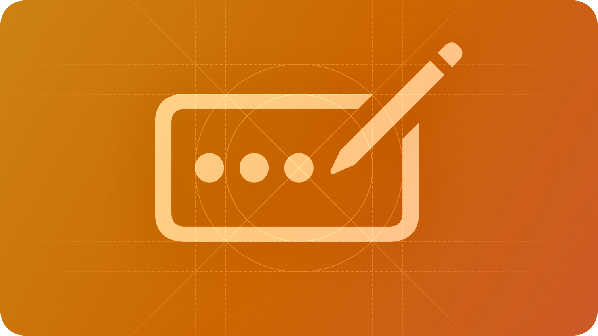

# Introduction

Cascade is designed to be extensible. You can register your own components using `cascade.RegisterComponent`, making them available on all `App` and `ComponentContext` objects.



## RegisterComponent

To register a component, you provide a name and a "maker" function.

### Function Signature

```luau
function(name: string, make: (self: any, properties: any) -> (any, Instance?))
```

### Basic Example

```luau
cascade.RegisterComponent("RedLabel", function(self, properties)
    local object = self:Label({
        Text = properties.Text or "Default Text",
        TextColor3 = Color3.fromRGB(255, 0, 0),
    })

    return object
end)

-- Now you can use it like any built-in component:
local app = cascade.New()
app:RedLabel({ Text = "Hello World" })
```

## Why use Custom Components?

1. **Reusability**: Wrap complex UI patterns (like a titled row with a slider and a value label) into a single component.
2. **Consistency**: Ensure consistent styling and behavior across your application by creating higher-level primitives.
3. **Theming**: Custom components automatically inherit the theme and accent from their parent context.

## Next Steps

- [Creating a Component](./creating-a-component.md): Learn how to build a component from scratch.
- [Internal Modules](./internal-modules.md): Discover how to use `Creator` and `Binder` to build powerful components.
